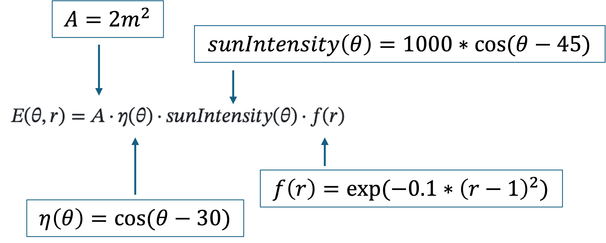

<table>

<td></td>

<td>
<h1>Maximizing Solar Panel Output for a Fixed Area</h1>

Use MATLAB to optimize solar panel geometry to maximize solar irradiance and energy production.

</table>

## Motivation
Industries ranging from renewable energy companies to civil and electrical engineering firms frequently optimize solar panel layouts to maximize power output, especially as solar technology expands across residential rooftops, commercial buildings, and large‑scale solar farms. In this project, students will practice skills widely used in industry, including numerical optimization, MATLAB programming, and design‑based decision-making. With solar installations becoming more widespread, these skills will help those in engineering roles design sustainable energy systems in constrained environments.

## Project Description

Use MATLAB to formulate and solve an optimization problem: Given a fixed area, determine the optimal tilt angle and aspect ratio of a solar panel to maximize the total energy output.

Solar panel energy output depends on:
- The tilt angle with respect to the sun
- The shape (aspect ratio) of the panel
- The available area for installation

The goal is to apply numerical optimization techniques in MATLAB to find the best configuration that maximizes energy output under simplified assumptions. You have a total area of 2 square meters to place a solar panel. The panel can have any rectangular shape but must stay within this total area.

The total energy output (in simplified units) can be approximated as:

$$E(\theta, r) = A \cdot \eta(\theta) \cdot sunIntensity(\theta) \cdot f(r)$$

In words, this equation states that the energy output of a solar panel depends on two variables: θ (the tilt angle of the solar panel, in degrees) and r (the aspect ratio, or shape, of the rectangular solar panel). The energy output also depends on the area (A) of the solar panel - we are told that the area is fixed at 2 m². The energy output of the solar panel depends on θ through an efficiency function (η(θ)), which models the effect of the tilt angle on the solar panel's energy efficiency, and a sunIntensity function (sunIntensity(θ)), which models the variation in sunlight intensity hitting the solar panel at different tilt angles. Finally, the energy output of the solar panel also depends on a shape efficiency function f(r), which models the effect of the solar panel's energy efficiency based on the aspect ratio, or shape, of the rectangular solar panel. 

The given value for A, suggested starting ranges for θ and r, and the equations for the efficiency function, sunIntensity function, and shape efficiency function, are provided below:
- **A = 2 m²** (fixed area)
- **θ** is the tilt angle (in degrees), θ ∈ [0°, 90°]
- **r** is the aspect ratio (length/width), with r ∈ [0.5, 4]
- **η(θ) = cos(θ − 30°)** (efficiency function based on tilt angle)
- **sunIntensity(θ) = 1000 · cos(θ − 45°)** (sunlight intensity variation based on tilt angle)
- **f(r) = exp(−0.1 · (r − 1)²)** (efficiency function based on aspect ratio)

Your task: Find the optimal θ and r that maximizes energy output, using the provided energy function E(θ, r).

### Suggested Steps
Open the "SolarPanel_StudentProjectTemplate.mlx" Live Script in MATLAB as a starting point for your project. More detailed implementation guidelines for each suggested task are provided in the Live Script file.

1. Define the objective function in MATLAB (the energy function).
      - Plug the given values and equations into the energy output equation, as shown below:
            
3. Use a [problem-based optimization workflow](https://www.mathworks.com/help/releases/R2026a/optim/ug/problem-based-workflow.html?searchPort=57359) to find the values of θ and r that maximize the energy output. Constrain the values: 0° ≤ θ ≤ 90° and 0.5 ≤ r ≤ 4.
4. Plot the objective function using `meshgrid` and [`surf`](https://www.mathworks.com/help/matlab/ref/surf.html) to visualize E(θ, r) as a 3D surface plot. Then, print the optimal angle, ratio, and corresponding energy output.

### Expected Results for Project Solution

- Numerical value for optimal tilt angle 
- Numerical value for optimal aspect ratio 
- Numerical value for maximum energy output - note: this value will be in simplified arbitrary units that, in a real-world context, would more often be defined in units of solar irrandiance (watts per m²).
- Visualization of E(θ, r)

## Learning Outcomes

- Formulate a real-world problem as a mathematical optimization problem
- Apply a problem-based optimization workflow to compute the optimal tilt angle and aspect ratio that maximize energy output, and interpret the numerical solution
- Analyze and interpret a multivariable objective function through visualization

## Suggested Background Material

### 1. Basic Solar Energy Concepts
- How solar panels convert sunlight to electricity (photovoltaic effect)
- Factors affecting solar output: tilt, orientation, shading, and surface area
- Concept of solar irradiance and why it varies with angle

### 2. Trigonometry and Geometry
- Understanding angles
- Cosine function
- Aspect ratio and area constraints for rectangles

### 3. Introduction to Optimization
- Core math foundations: algebra, matrix operations, functions (as math expressions), some calculus (core concept in optimization but not explicitly required to complete this project)
- Structure of an optimization problem and conceptual understanding of objective function, variables, and constraints
- Difference between maximizing and minimizing an objective function

### 4. MATLAB Fundamentals
- Writing functions
- Element-wise matrix operations
- MATLAB Optimization Workflow
- Plotting surfaces using `meshgrid` and `surf`

### 5. Numerical Modeling Skills
- Building simplified models of real systems
- Interpreting plots and optimization outputs

## MathWorks Tutorials and Helpful Resources
- [MATLAB Onramp](https://matlabacademy.mathworks.com/details/matlab-onramp/gettingstarted)
- [Optimization Onramp](https://matlabacademy.mathworks.com/details/optimization-onramp/optim)
- [Problem-Based Optimization Workflow](https://www.mathworks.com/help/optim/ug/problem-based-workflow.html)
- [Creating a 3D Surface Plot](https://www.mathworks.com/help/matlab/ref/surf.html)

## Project Difficulty
- Beginner
   - High school senior
   - Matriculating or 1st-year undergraduate student
   - 1st or 2nd year community college student

