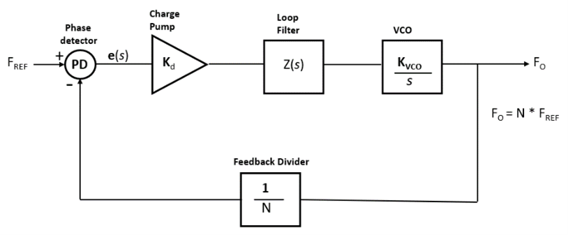

**Project 202:** Fill out this <strong>[form](https://forms.office.com/Pages/ResponsePage.aspx?id=ETrdmUhDaESb3eUHKx3B5lOTzSa_A6lPqq2LJKzvpM5UMTBZRkc4UTRETjFERVRDWllQRE40OUFSQS4u)</strong> to  register your intent to complete this project and learn about the reward

<table>
<td></td>
<td>
<h1>Behavioral Modelling of Phase-Locked Loop using Deep Learning Techniques</h1>

 Leverage a deep learning approach to extract behavioral models of mixed-signal systems from measurement data and circuit simulation.

</table>

## Motivation

Phase-locked loops (PLLs) are the heart of many electronic systems.  PLL designs can be large and complex. They have a unique property that makes their analysis and simulation even just for their deterministic behaviour quite difficult.
System designers in a chip design company would like to be able to get estimates of the key performance metrics of a PLL (like lock time, phase noise, operating frequency) through less time-consuming simulation and without going too deep into the nitty gritty details of the building blocks. They need to make design decisions and choose a PLL architecture that will meet the specification given to them. They need to accomplish this without having to design all the PLL components in detail. Once this top-down design process is completed the system engineer would be simulating the PLL in detail and verify that the design indeed meets the specifications. 
 To summarize, an effective behavioural level model for a PLL will be quite effective in getting system engineer’s job done in a timely manner. Deep learning techniques can be helpful in achieving that goal. 

## Project Description

Based on the discussion above, the key requirements for a deep learning based behavioral level model for a PLL should be as follows:
1.	Model needs to be abstract enough so that results can be computed in a reasonable amount of time (deep learning models should be fast).
2.	The model needs to be generic enough so that it should estimate the performance metrics even when detailed design of the building blocks is not available. 
3.	Model needs to capture non-ideal effects of the PLL so that we can use to estimate phase noise (a key metric in PLL design).

To fulfill the above requirements we need to study various deep learning techniques available and pick the one that is going to be helpful in meeting the above 3 key requirements. Based on the PLL design that are prevalent (block diagram representation of a PLL is shown below) in the industry following are the key input parameters that a system designer might want to play with in choosing a PLL architecture that meets specifications:

|  | 
|:--:| 
| ***Figure1**: PLL block diagram* |

1.	Input clock frequency 
2.	Phase Frequency Detector (PFD): 
	- Dead-band compensation
3.	Charge pump: 
	- Input current
	- Leakage current
4.	Loop filter: 
	- R and C values (number of components vary depending on which order filter has been used)
5.	Voltage-controlled oscillator (VCO): 
	- Voltage sensitivity
	- Phase noise
6.	Clock divider value

And following are the target metrics that a PLL system designer is interested in:
1.	Lock time
2.	Phase noise
3.	Operating frequency

Suggested steps:
1.	Perform literature research prior to starting the work. One needs to familiarize oneself with the basics of PLL design and various Deep learning techniques available.
2.	Generate training data to be fed to the deep learning model. One will be required to setup a [PLL model](https://www.mathworks.com/help/msblks/phase-locked-loop.html) using [Mixed-Signal Blockset™](https://www.mathworks.com/help/msblks/index.html) and setup Simulation-In-Loop to gather training data.

|  | 
|:--:| 
| ***Figure2**: PLL simualtion in loop* |

3.	Once the training data has been collected the modeling of the selected deep learning model (CNN, RNN, GAN etc..) will be the next step using [Deep Learning Toolbox™](https://www.mathworks.com/help/deeplearning/index.html?searchHighlight=deep%20learning%20toolbox&amp;s_tid=srchtitle).

|  | 
|:--:| 
| ***Figure3**: Deep learning model* |

4.	Once the model has been trained the next step will be to test it using some test data that we can generate using our PLL model in Simulink®.

Project variations:
1.	Apply above steps for different mixed-signal systems like ADCs, DACs or CDRs.

Advanced project work:
1.	Create a deep learning model that takes in the target metrics as input and provides you the probable input parameter values that may meet the specification of the desired PLL.
2.	Estimate sensitivity of the different parameters of the behavioral model, especially related to silicon technology.

## Background Material

- [Mixed-Signal Blockset](https://www.mathworks.com/help/msblks/index.html?s_tid=srchtitle)
- [Deep Learning Toolbox](https://www.mathworks.com/help/deeplearning/index.html?searchHighlight=deep%20learning%20toolbox&s_tid=srchtitle)
- [Machine Learning for Electronic Design Automation](https://www.mathworks.com/videos/machine-learning-for-electronic-design-automation-1544592067829.html)
- [Center For Advanced Electronics Through Machine Learning](https://c3ps.gatech.edu/center-advanced-electronics-through-machine-learning-caeml)

Suggested readings:

[1] Razavi, Behzad. RF Microelectronics. Upper Saddle River, NJ: Prentice Hall PTR, 1998.

[2] Banerjee, Dean. PLL Performance, Simulation and Design. Indianapolis, IN: Dog Ear Publishing, 2006.

[3] B. Khailany et al., "Accelerating Chip Design With Machine Learning," in IEEE Micro, vol. 40, no. 6, pp. 23-32, 1 Nov.-Dec. 2020, doi: 10.1109/MM.2020.3026231.

## Impact

Accelerate mixed-signal design and analysis thereby reducing Time-To-Market for semiconductor companies.

## Expertise Gained 

Artificial Intelligence, Deep Learning, Machine Learning, Modeling and Simulation, Neural Networks, RF and Mixed Signal, Optimization, Signal Processing

## Project Difficulty

Master's, Doctoral

## Proposed By

[pragatikt](https://github.com/pragatikt)

## Project Discussion

[Dedicated discussion forum](https://github.com/mathworks/MathWorks-Excellence-in-Innovation/discussions/32) to ask/answer questions, comment, or share your ideas for solutions for this project.

## Project Number

202
