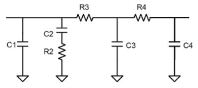

# Behavior-modeling-of-PLL
The project is refer to the Github project below:
[<i>/MathWorks-Excellence-in-Innovation/projects/Behavioral Modelling of Phase-Locked Loop using Deep Learning Techniques/</i>](https://github.com/mathworks/MathWorks-Excellence-in-Innovation/tree/main/projects/Behavioral%20Modelling%20of%20Phase-Locked%20Loop%20using%20Deep%20Learning%20Techniques)

The words below are some explanation of our work.

## Function Description
The final fitting function derived from our final trained neural network model os stored in the folder <i>"final_function"</i>.

In that folder, there are 7 fitting functions, functions <i>"fitA"</i> to <i>"fitF"</i> are individual Neural Network fitting functions of 15 input parameters to 6 output parameters, respectively. Besides, the function <i>"fitNet"</i> is the total function that calls functions from <i>"fitA"</i> to <i>"fitF"</i>, which could estimate 15 input parameters and obtain 6 output parameters at the same time.

## Our Dataset
The dataset used in the experiment is obtained through the Integer N PLL with Single Modulus Prescaler simulation model in the Mixed-Signal Blockset extension provided by MATLAB. 
  **NOTE:** The specific MATLAB version is R2020a.

#### INPUT/OUTPUT Parameters
The 15 input parameters we focus on are: deadband compensation for PDF, output current and leakage current for charge pump, voltage sensitivity and free running frequency for VCO, clock divider value for prescaler, resistor and capacitor values for loop filter and the frequency of the PLL reference signal. 

The 6 output parameters we focus on are: the operating frequency and lock time of the PLL, phase noise of the PLL at 200KHz, 1MHz, 3MHz and 10MHz from the operating frequency offset.

#### Dataset Element Description
For each row of input parameters, recorded from left to right are the frequency of the PLL reference signal, deadband compensation, output current, leakage current, current imbalance, clock divider value, voltage sensitivity, free running frequency, C1 to C4 and R2 to R4 in the 4th order loop filter model. 
||
|:---:|
|*4th order loop filter*|

For each row of output parameters, recorded from left to right are operating frequency, lock time and the phase noise of the PLL at 200KHz, 1MHz, 3MHz and 10MHz from the operating frequency offset. 

#### Dataset Files Description

We have divided all the data obtained into training and test datasets. The <i>"input_nn.mat"</i> and <i>"output_nn.mat"</i> files store the input parameters and output parameters of our test set respectively. The test set has a total of 105 sets of data and each row is a corresponding set of simulation results. 

The <i>"training_dataset.mat"</i> file stores the training set we obtained. The training set has a total of 942 sets of data, each row represents one of our simulation examples, including the input and output parameters we are concerned about.The arrangement order of each parameter is consistent with the test set. 

## Fitting Result
The average error for six output parameters on our test dataset is as follows:
|Output parameters| Errors|
|:--|:--:|
|Operating frequency|2.38%|
|Lock time|5.93%|
|Phase noise(Δf=200KHz)|  10.97%|
|Phase noise(Δf=1MHz)  |  8.50% |
|Phase noise(Δf=2MHz)  |  8.65% |
|Phase noise(Δf=10MHz) |  6.92% |

## Shortage of the Model
When Pragati, the subject-matter expert, debugged our model, he found some shortages or problems about our model in term of "Operating frequency". After discussions, we decide to add a part "Shortage of our model" to explain the problems and the reasons we found.  

#### Data Range of our Dataset
First of all, it is necessary to explain the data range of our Dataset(mainly for input parameters) for further detailed explanation.

In order to simplify the data acquisition process, the input parameters we take values within a certain range.
+ Input frequency range is 1MHz to 2MHz. 
+ Dead band compensation ranges from 10&times;10-12 to 100&times;10-12. 
+ Output current of the charge pump ranges from 10&times;10-4 to 50&times;10-4. 
+ Leakage current of the charge pump is in the range of 10&times;10-9 to 100&times;10-9. 
+ Current imbalance of the charge pump is set to a constant 1&times;10-7. 
+ Divider range is from 1000 to 2000. 
+ Voltage sensitivity of the VCO ranges from 10&times;106 to 30&times;106.  
+ Free running frequency of the VCO is fixed to 20MHz deviation from the theoretical operating frequency. 
+ For C1 to C4 of loop filter, we set the range as 200&times;10-14 to 900&times;10-14, 100&times;10-13 to 1000&times;10-13, 50&times;10-15 to 1100&times;10-15, 10 to 1000, respectively. 
+ For R2 to R4 of the loop filter, we set the range as  50&times;102 to 900&times;103, 50&times;103 to 1100&times;103, and 5 to 150, respectively. 
( The C3, C4, R3, R4 can be set to 0 to simulate different orders of loop filter.)

#### Shortage——the over fitting of the "Operating Frequency"

When debugging, it is found that our model will generate large errors in term of "Operating Frequency" when faced with some inputs. After further research and discussion, we believe that the most likely reason is that our training dataset is so small that the model is overfitting. For this reason, the model cannot handle it correctly when faced with inputs beyond our preset range. What's more, dure to the overfitting of the model, for some specific input values, our model may generate wrong "Operating Frequency" as well.

Finally we come to the conclusion that **our model in term of "Operating Frequency" may only be limited to a small input range, and can't do something about more complex situations.** To achieve more accurate results on a larger scale, we need more training sets with a wider range to train our model.

## Acknowledgements
We are grateful to @pragatikt for his suggestions and help in the overall project implementation and inspection.
Thank you very much.
