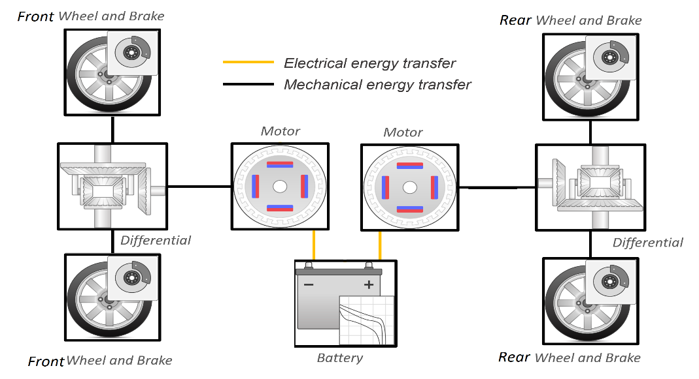
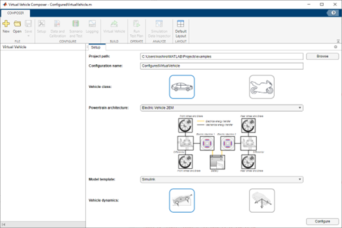

Fill out this <strong>[form](https://www.mathworks.com/academia/student-challenge/mathworks-excellence-in-innovation-signup.html?tfa_1=Energy%20Management%20for%20a%202-Motor%20BEV%20using%20Model-Predictive%20Control&tfa_2=246)</strong> to **register** your intent to complete this project.

Fill out this <strong>[form](https://www.mathworks.com/academia/student-challenge/mathworks-excellence-in-innovation-submission-form.html?tfa_1=Energy%20Management%20for%20a%202-Motor%20BEV%20using%20Model-Predictive%20Control&tfa_2=246)</strong> to **submit** your solution to this project and qualify for the rewards.

<table>
<td></td>
<td>
<h1>Energy Management for a 2-Motor BEV using Model-Predictive Control</h1>

Develop a Model-Predictive Control algorithm to optimally distribute torque in a 2-motor Battery Electric Vehicle (BEV) powertrain.

</table>

## Motivation

Electric Vehicle production is rapidly increasing due to customer demand, global policy changes, and improvements in battery technology.  It is estimated that EV sales could reach 33% of the global market by 2028 [Reuters]( https&#58;//www.reuters.com/business/autos-transportation/electric-vehicles-could-take-33-global-sales-by-2028-alixpartners-2022-06-22/).  
Many EV’s powertrain architectures are integrating more than 1 electric motors to add all-wheel, improve acceleration performance, or add lateral vehicle control capabilities.  
To reduce energy consumption and maximize driving range of EV’s, it is desirable to operate multiple electric motors as optimally as possible over many different operating and environmental conditions.  
Current energy management supervisory control strategies may not be incorporating formal optimization methods. A Model-Predictive Control algorithm has shown promise for energy management of electrified powertrains [1]. 

## Project Description

For this project the following 2-motor Electric Vehicle architecture is proposed:

Work with the [Powertrain Blockset™](https://www.mathworks.com/products/powertrain.html) and [Model-Predictive Control Toolbox™](https://www.mathworks.com/products/model-predictive-control.html) products to develop a vehicle model and Model-Predictive Control algorithm using MATLAB® and Simulink®.  Test and simulate your model over various drive cycles to quantify any improvements over the baseline controller.

Suggested steps:
1.	Become familiar with the Powertrain Blockset examples listed in Background Material section below.
2.	Download the Powertrain Blockset 2-motor BEV model. You will need MATLAB version R2023a or later and license to the Powertrain Blockset. Below the Steps to generate the model:
    1. Open MATLAB and go to the Apps tab.  Under Automotive, open the Virtual Vehicle Composer (VVC) App
    2. In the VVC app, select ‘New’.  Then select ‘Electric Vehicle 2EM’ for the powertrain architecture 
    
       
    
    3. Select Simulink for the model template and longitudinal vehicle dynamics as shown.  Then press the Configure button.  
    4. In the Data and Calibration tab of the VVC app, the user has the option to parameterize the vehicle or use the default values.
    5. Press the ‘Virtual Vehicle’ button in the VVC app menu to generate the 2 motor BEV model
3.	Run the model and review the output in the scope contained in the Visualization subsystem.  Become familiar with the dynamic outputs of this closed-loop model as it simulates over a drive cycle.  
4.	Design a linear or non-linear MPC algorithm using the Model-Predictive Control Toolbox.  
a.	For example, the MPC controller could be designed to optimally distribute torque and reduce energy consumption while maximizing driving range
5.	Integrate the MPC algorithm into a model reference that operates at a 10ms fixed-time step (use the existing vehicle controller as a reference).
6.	Evaluate your MPC algorithm in the vehicle model using the WLTP Class 3 and HWFET drive cycles using the [Drive Cycle Source](https://www.mathworks.com/help/autoblks/ref/drivecyclesource.html) block in Simulink (You may also need to install the Dive Cycle Source add-on to download the WLTP3 and HWFET cycles). Show your improvement in terms of energy or MPGe metrics versus the baseline controller.  Also show that the implemented constraints of the MPC algorithm were not violated.  As a validation step, run your controller on different drive cycles (i.e. FTP75, US06).  

Project variations:
1.	Explore other ways to optimize the powertrain components, including the differential ratios, motor torque vs. speed curves, and battery sizing.  

Advanced project work:
1.	Investigate if your MPC algorithm will run in real time, using a Hardware-In-Loop simulator such as Speedgoat, dSPACE, or National Instruments.  MPC algorithms can be more computationally expensive and must be able to execute in a real time to control a physical vehicle.  Try to deploy your MPC to an embedded processor.  
2.	Try different powertrain architectures.  Here are 2 suggestions: 
    1.	Two electric motors are on a single axle (one for each wheel). Investigate ways to perform lateral vehicle control called torque vectoring, where the motors can be controlled to induce a yaw moment of the vehicle while in a turn. Develop an MPC controller for this use case.  
    2.	Implement a 2-speed transmission on the rear motor. The gear control variable would come from the MPC controller and this problem becomes a mixed integer problem.  

## Background Material

-	[Model and Simulate Automotive Systems Using Powertrain Blockset]( https://www.mathworks.com/videos/model-and-simulate-automotive-systems-using-powertrain-blockset-1506349847101.html)
-	[MathWorks Hybrid Electric Vehicles video series]( https://www.mathworks.com/videos/series/hybrid-electric-vehicles.html) 
-	[Full Vehicle Simulation for Electrified Powertrain Selection]( https://www.mathworks.com/videos/full-vehicle-simulation-for-electrified-powertrain-selection--1558699980124.html)
-	[Model Predictive Control Tech Talks](https://www.mathworks.com/videos/series/understanding-model-predictive-control.html)
-	[Model Predictive Control Toolbox documentation](https://www.mathworks.com/help/mpc/)

Suggested readings:

[1] Luca Cavanini et al, “Processor-In-the-Loop Demonstration of MPC for HEV’s Energy Management System”, 10th IFAC Symposium Advances in Automotive Control, August 28-31 2022, The Ohio State University, Columbus Ohio, USA

## Impact

Reduce energy consumption while maintaining best motor performance.

## Expertise Gained 

Sustainability and Renewable Energy, Automotive, Control, Electrification, Modeling and Simulation

## Project Difficulty

Master's, Doctoral

## Project Discussion

[Dedicated discussion forum](https://github.com/mathworks/MathWorks-Excellence-in-Innovation/discussions/83) to ask/answer questions, comment, or share your ideas for solutions for this project.

## Project Number

246
