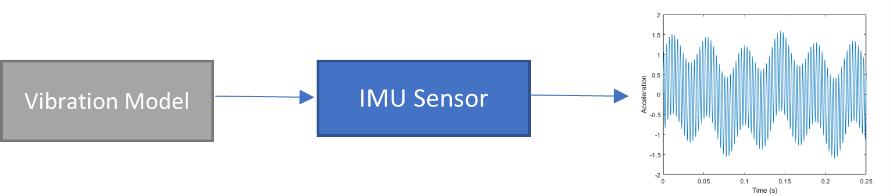

# Vibration Detection and Rejection from IMU Data

<table>
<td></td>
<td>
<h1>Complete MATLAB Implementation Guide</h1>

Step-by-step guide to develop vibration models and compensation algorithms for IMU data using MATLAB.

</table>

## 🚀 Quick Start Guide

**Ready to run the project?** Follow these steps:

1. **[Setup MATLAB Environment](#-matlab-environment-setup)** ⚙️
2. **[Run Part 1: Vibration Model](#-part-1-vibration-model-development)** 📊
3. **[Run Part 2: Vibration Compensation](#-part-2-vibration-compensation-algorithms)** 🔧
4. **[View Results](#-expected-outputs-and-results)** 📈

---

## Motivation

Inertial measurement units (IMUs) are used in many navigation applications including UAVs, ground robots, and underwater vehicles. In particular, IMU is key sensor to allow stable flight of micro aerial vehicles (MAVs). However, data from IMU can be affected by high vibration level. Vibrations can come from motors, quadcopter rotors, and the surrounding environment. Accelerometer and gyroscope data can be negatively impacted by vibration of the vehicle, which can in turn degrade the vehicle’s ability to navigate accurately. To build systems that tolerate vibration, designers must have a way of simulating IMUs subject to vibration. In addition, algorithms are needed to detect the vibration signal in the IMU data.

## Project Description

 This project has two main components: developing a simulation model for an IMU subject to vibration, and compensating for those signals in an IMU. The [Navigation Toolbox™](https://www.mathworks.com/products/navigation.html) and [Sensor Fusion and Tracking Toolbox™](https://www.mathworks.com/products/sensor-fusion-and-tracking.html) both contain a high fidelity IMU model – imuSensor. In the first part of the project, you will analyze vibration signals and determine how to drive the imuSensor to accurately simulate an IMU subject to vibration. You can do this using classical techniques like those in [Signal Processing Toolbox™](https://www.mathworks.com/products/signal.html) (see [Vibration Analysis](https://www.mathworks.com/help/signal/vibration-analysis.html?s_tid=CRUX_lftnav)) or with Machine Learning and Deep Learning techniques. In the second part of the project, you will develop techniques to detect and remove vibration from the IMU output.

Suggested steps:

Part 1:

1.	Become familiar with the MATLAB IMU simulation model [imuSensor](https://www.mathworks.com/help/nav/ref/imusensor-system-object.html). Simulate IMU signals for a stationary device and for one in motion using [waypointTrajectory](https://www.mathworks.com/help/fusion/ref/waypointtrajectory-system-object.html) (available in the the Navigation Toolbox and Sensor Fusion and Tracking Toolbox, respectively).
2.	Become familiar with what IMU signals look like when the device is subject to vibration. You can see a simulation of this in [2] or look at actual IMU datasets in [ds1] and [ds2].
3.	Develop a Vibration Model to be used with the imuSensor as in the diagram below. The Vibration Model should cause the output of the imuSensor to mimic the output of an IMU under vibration. Your Vibration Model can be created with classical signal processing techniques or using a generative AI technique. Can you use this model in conjunction with the waypointTrajectory to simulate a moving device which is subject to vibration?

|  | 
|:--:| 
| ***Figure 1**: IMU + vibration model* |

Part 2:

4.	Develop a Vibration Compensation algorithm for use after the imuSensor as in the diagram below. The Vibration Compensation can be as simple as detecting if vibration is present and setting a Boolean flag, or more a sophisticated algorithm that attempts to filter or remove the vibration signal from the IMU output. You can do this with classical filtering techniques available in Signal Processing Toolbox, Wavelet Toolbox, or with ML/DL approaches.

|  | 
|:--:| 
| ***Figure 2**: Vibration compensation* |

Advanced project work:
 
The [MATLAB Support Package for Arduino](https://www.mathworks.com/matlabcentral/fileexchange/47522-matlab-support-package-for-arduino-hardware) allows you to record IMU data in MATLAB. Mount an Arduino with an IMU to an object whose vibration you are modeling (a vehicle, a motor, a bridge) and store that data in MATLAB. Use this real data to compare against your vibration model.

## Background Material
 
- Navigation Toolbox: [Introduction to Simulating IMU Measurements](https://www.mathworks.com/help/nav/ug/introduction-to-simulating-imu-measurements.html)
- Signal Processing Toolbox: [Vibration Analysis](https://www.mathworks.com/help/signal/vibration-analysis.html?s_tid=CRUX_lftnav) 

Datasets:

- [ds1] [Kaggle Accelerometer Data Set for “Prediction of Motor Failure Time”](https://www.kaggle.com/datasets/dhinaharp/accelerometer-data-set)

- [ds2] [Bearing Vibration Data under Time-varying Rotational Speed Conditions](https://data.mendeley.com/datasets/v43hmbwxpm/2)

Suggested readings:

- [1]	Capriglione, D., et al. "Experimental analysis of IMU under vibration." 16th IMEKO TC10 Conference. 2019.

- [2]	Güner, Ufuk, Hüseyin Canbolat, and Ali Ünlütürk. "Design and implementation of adaptive vibration filter for MEMS based low cost IMU." 2015 9th International Conference on Electrical and Electronics Engineering (ELECO). IEEE, 2015.

- [3]	Zaiss, Curtis. IMU design for high vibration environments with special consideration for vibration rectification. MS thesis. Graduate Studies, 2012.

## Impact

 Improve navigation systems by making them robust against vibrations.

## Expertise Gained 

Drones, Autonomous Vehicles, Robotics, Modeling and Simulation, Sensor Fusion and Tracking, State Estimation, Signal Processing

## Project Difficulty

Doctoral, Bachelor, Master's

## Project Discussion

[Dedicated discussion forum](https://github.com/mathworks/MathWorks-Excellence-in-Innovation/discussions/65) to ask/answer questions, comment, or share your ideas for solutions for this project.

## Project Number

231
